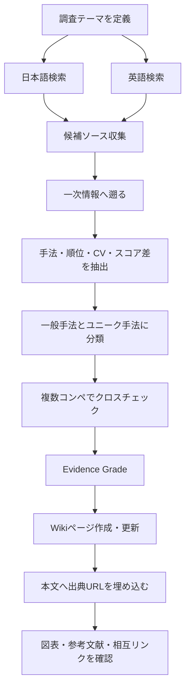
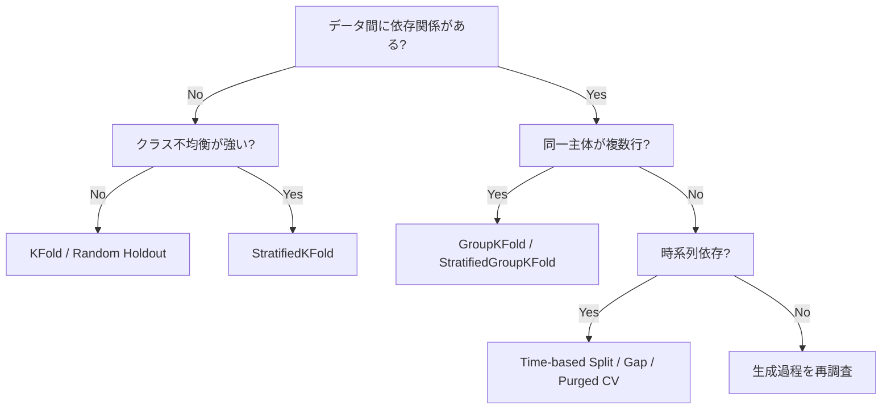

# Kaggle Research Skill

## Goal

Kaggleで公開されている情報を広く調査し、コンペで実際に効果が確認された手法を、再利用可能な知識として `wiki/` に体系化する。

一般的な手法だけでなく、特定コンペで大きく効いたユニークな工夫、Validation設計、データ分割、評価指標への最適化、リーク対策、後処理、アンサンブル、疑似ラベル、外部データ、推論時工夫まで対象とする。

**ソース保存専用ディレクトリは作らない。** 各Wiki Markdownを自己完結させ、本文の主張に出典URLを直接埋め込み、ページ末尾にも参考文献を置く。

## Non-goals

- Pythonコード集にしない。
- ライブラリAPIの羅列をしない。
- 根拠のない「Kaggleでは定番」「精度が上がる」という断定をしない。
- 1つの記事だけを読んで一般化しない。
- Public LBだけを根拠に手法を評価しない。

## Mandatory research scope

毎回、日本語と英語の両方で検索する。

優先する情報源:

1. Kaggle Competition の公式ページ
2. Kaggle Discussion の上位解法 / Solution / Writeup
3. Kaggle Notebook
4. 上位入賞者本人のGitHubリポジトリ
5. 上位入賞者本人のブログ・スライド・発表資料
6. Zenn / Qiita / はてなブログ等の日本語解説
7. 技術ブログ・論文・公式ドキュメント

二次まとめだけに依存せず、可能な限り一次情報まで遡る。

## Coverage policy

「満遍なく調査」は検索件数ではなく、以下の軸を偏りなく確認することを意味する。

| 軸 | 必ず確認する観点 |
|---|---|
| データ種別 | Tabular / CV / NLP / Time Series / Audio / Multimodal / Recommendation・Ranking / Optimization系 |
| Validation | Hold-out / KFold / Stratified / Group / StratifiedGroup / Time-based / Purged・Gap / Adversarial Validation |
| モデル | GBDT / CNN / Transformer / Foundation Model / Linear・kNN等 / specialized architecture |
| 改善 | Feature Engineering / Augmentation / Sampling / Loss / Pretraining / Fine-tuning / Pseudo Label / External Data |
| 推論 | TTA / threshold / calibration / post-processing / test-time adaptation |
| Ensemble | averaging / weighted blend / rank averaging / stacking / seed・fold ensemble |
| コンペ戦略 | CV-LB correlation / leaderboard probing / shake-up対策 / inference budget / reproducibility |

テーマが限定されている場合は無関係なモダリティを水増しせず、同一領域内で複数コンペ・複数年代・複数上位解法を比較する。

## Research workflow



## Evidence grading

手法の「効果」を必ずエビデンス強度とセットで扱う。

| Grade | 根拠 |
|---|---|
| A | 上位解法に具体的なablation、CV差、LB差、順位差などの定量根拠がある |
| B | 上位入賞者本人が有効性を明示し、最終解法に採用している |
| C | 複数の独立した上位解法で同じ傾向が確認できる |
| D | 単一記事・経験談・理論上の推測のみ。参考扱い |

数値がない場合は「どの程度効いたか不明」と明記する。

## Extraction schema

各手法について最低限次を抽出する。

| Field | 内容 |
|---|---|
| Method | 手法名 |
| Category | split / CV / feature / model / loss / augmentation / ensemble / postprocess 等 |
| Competition | 使用されたコンペ |
| Modality | Tabular / CV / NLP 等 |
| Rank / Medal | 順位またはメダル。確認できる場合のみ |
| Metric | コンペ評価指標 |
| Validation | ローカル評価設計 |
| Effect | CV/LB/ablationの差。確認できる場合のみ |
| Why it worked | 効いた理由の仮説または著者説明 |
| Applicability | どんな条件で再利用できるか |
| Risks | leakage / overfit / compute / instability 等 |
| Evidence | A/B/C/D |
| Sources | 一次情報を優先したURL |

## General vs unique methods

### 1. Foundation / General

複数コンペで再現されやすい基本手法。例: 正しいCV設計、seed/fold ensemble、GBDT baseline、augmentation、OOF、metric-aligned validation。

### 2. Strong situational methods

条件が合えば非常に強いが、常に使えるわけではない手法。例: pseudo labeling、external data、adversarial validation、target encoding、pretraining、TTA。

### 3. Competition-specific / Unique

データ生成過程・評価指標・制約を深く突いた特殊解法。一般化可能な「原理」と、そのコンペ固有の「実装」を分けて説明する。

## Visualization requirements

文章だけで終わらせない。主要Wikiページには内容に応じて以下のうち2種類以上を入れる。

- Markdown比較表
- Mermaid flowchart
- Mermaid sequenceDiagram
- Mermaid mindmap
- Mermaid quadrantChart
- Mermaid xychart-beta（数値根拠がある場合のみ）
- 出典付き画像・模式図

数値を捏造してグラフを作らない。スコア差・順位・採用頻度など、出典から確認できる値だけを可視化する。

ASCII artは使わず、関係・フロー・階層はMermaidを優先する。

### Example: split selection



## llm-wiki output model

知識の正本は `wiki/` のMarkdownだけにする。

```text
wiki/
  index.md
  concepts/
  validation/
  metrics/
  methods/
  modalities/
  competitions/
  synthesis/
```

1ページ1テーマを原則とし、巨大な1ファイルに詰め込まない。

各ページは「調査結果」と「出典」を同じファイルに保持する。別のソース保管層は作らない。

## Wiki page rules

すべてのwikiページにYAML frontmatterを付ける。

```yaml
---
type: knowledge
domain: kaggle
topic: validation
confidence: high
created: YYYY-MM-DD
updated: YYYY-MM-DD
source_count: 0
tags:
  - kaggle
  - validation
---
```

本文は原則として次の順で構成する。

1. TL;DR
2. 何が問題なのか
3. 基本原理
4. 一般的な手法
5. 効果が強かった手法
6. ユニークな手法
7. どの条件で使うべきか
8. 失敗例・リーク・注意点
9. 比較表
10. Mermaid等の図
11. 実戦チェックリスト
12. 関連ページ
13. 参考文献

詳細テンプレートは `references/wiki-template.md` を読む。

## Citation rules

参考文献は必須。URLはWiki Markdownへ直接埋め込む。

- Web由来の具体的事実・数値・順位・採用手法には、直後または同じ段落にMarkdownリンクを付ける。
- 例: `この手法でCVが改善したと報告されている（[1st place solution](https://...)）。`
- 比較表の `Source` 列にも可能な限り直接リンクを置く。
- 最終ページ末尾に `## 参考文献` を置く。
- URLだけでなく、タイトル・著者または投稿者・媒体・公開年/日付（確認できる範囲）を記載する。
- Kaggle Discussionは Competition名とDiscussion/Writeup名を記載する。
- GitHubはリポジトリ名と該当README/solutionファイルを明示する。
- 二次記事から一次情報が辿れる場合、一次情報も併記する。
- 存在を確認していない参考文献を作らない。
- 同じ主張を複数ソースが支える場合は併記する。

## Cross-linking

既存ページと積極的に関連付ける。

- Validation記事 → `../validation/group-split.md`
- pseudo label記事 → `../methods/pseudo-labeling.md`
- CVコンペ記事 → `../modalities/computer-vision.md`

GitHub Pagesで閲覧できるよう、実ファイルへの相対Markdownリンクを基本とする。

## Research quality checks

- [ ] 日本語と英語の両方で検索した
- [ ] Kaggle一次情報を確認した
- [ ] 上位入賞者本人の情報を優先した
- [ ] 一般手法だけでなくユニークな工夫も調べた
- [ ] CV / split / metric / leakageを確認した
- [ ] Public LBだけで効果判定していない
- [ ] 定量値には出典がある
- [ ] 効果のEvidence Gradeを付けた
- [ ] 反例・失敗条件も記載した
- [ ] 表がある
- [ ] Mermaidまたは別の図がある
- [ ] 本文中に出典URLが埋め込まれている
- [ ] ページ末尾に参考文献がある
- [ ] wiki内の関連ページをリンクした

## No-code preference

このスキルの主目的は調査・解説・知識ベース構築であり、Pythonコードは原則出力しない。

コードよりも、図、比較表、具体的なコンペ事例、スコア・順位・ablationなどの根拠、適用条件と失敗条件を優先する。

## Final deliverable

調査タスクでは原則として以下を更新する。

1. `wiki/...` — 本文・図表・インライン出典URL・参考文献を含む統合ページ
2. `wiki/index.md` — 新規ページへの索引

既存wikiと矛盾する新しい根拠が見つかった場合、古い記述を無言で消さず、根拠・時期・条件の違いを明示して更新する。
