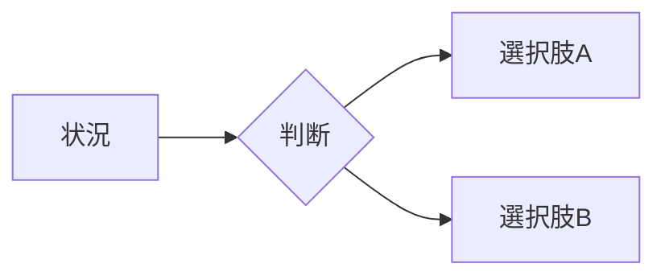

# Kaggle Wiki Page Template

```yaml
---
type: knowledge
domain: kaggle
topic: <topic-slug>
created: YYYY-MM-DD
updated: YYYY-MM-DD
tags:
  - kaggle
---
```

# <ページタイトル>

## TL;DR

3〜5行で結論を書く。

- 何を覚えるべきか
- いつ使うか
- 一番重要な注意点

## まず覚えること

重要点を3つ程度に絞る。

- **Point 1:**
- **Point 2:**
- **Point 3:**

## 直感

数式や歴史から入らず、「なぜ必要か」を短く説明する。

必要ならMermaidや模式図を使う。



## 使い分け

文章より比較表を優先する。

| 手法 | 使う場面 | 強み | 注意点 |
|---|---|---|---|
|  |  |  |  |

判断フローが有効ならMermaidを使う。

## Kaggleでの実例

実際の上位解法、Writeup、Notebookから、読者の判断に役立つ事例だけを載せる。

| Competition | Method | Result / Effect | Why it mattered | Source |
|---|---|---|---|---|
|  |  |  |  | [出典](https://example.com/) |

数値・順位・効果には必ず出典を付ける。効果量が不明なら推測しない。

## ユニークな工夫

コンペ固有の工夫がある場合だけ追加する。

- **コンペ固有:** 何が特殊だったか
- **一般化できること:** 他のコンペへ持ち込める原理

該当しなければこの節は作らない。

## 注意点

テーマに関係するものだけを書く。

- Data leakage
- Validation mismatch
- Public LB overfitting
- seed依存
- distribution shift
- 計算・推論時間

長い補足は `<details>` に入れる。

## Quick Reference

実戦中に見返せる短い表またはチェックリストにする。

- [ ] 評価指標と目的が一致している
- [ ] Validationで改善している
- [ ] leakageがない
- [ ] 適用条件を満たしている
- [ ] コストに見合う

## 次に読む

関連ページを2〜4件に絞る。

- [関連テーマ](../path/page.md)

## 参考文献

本文で利用した全ソースを列挙する。

1. [著者/投稿者, “タイトル”, 媒体, 公開日](https://example.com/)
2. [Kaggle Competition / Discussion / Writeup](https://example.com/)
3. [GitHub repository / solution file](https://example.com/)

## Writing rules

- 不要な章は省略する。
- 内部の調査プロセス、Skill、Jekyll、JavaScript、描画ライブラリの使い方は本文に書かない。
- 同じ内容を文章・表・図で繰り返さない。
- 表や図は文章より速く理解できる場合だけ使う。
- 専門用語は必要なら使うが、最初の登場時に短く説明する。
- 1段落を長くしすぎない。
- 重要度の低い補足で本文の流れを止めない。
- 可視化の実装方法は `visualization-guide.md` を参照し、読者には見せない。
