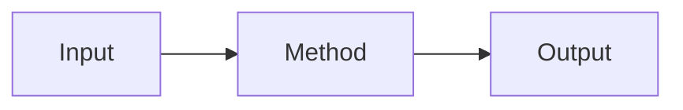

# Kaggle Wiki Page Template

```yaml
---
layout: default
title: <ページタイトル>
type: reference
domain: kaggle
topic: <topic-slug>
created: YYYY-MM-DD
updated: YYYY-MM-DD
source_count: 0
tags:
  - kaggle
---
```

# <ページタイトル>

2〜4行で定義を書く。

- 何か
- 何のために使うか
- 最も重要な前提条件

長い導入・歴史・「この記事では〜」は書かない。

## 使う場面

最短で判断できる表を優先する。

| 状況 | 適するか | 理由 |
|---|---|---|
|  |  |  |

必要なら「避ける条件」も同じ表に入れる。

## 仕組み

なぜ機能するのかを直感的に説明する。

関係・処理フローならMermaid、数式が本質ならLaTeXを使う。



図と同じ内容を長文で繰り返さない。

## 使い分け

類似手法・代替手法との違いを比較する。

| 手法 | 強み | 弱み | 適用条件 |
|---|---|---|---|
|  |  |  |  |

「何と迷うか」が分かる状態にする。

## Kaggleでの実例

実際の上位解法・Writeup・Notebookから、具体的な使われ方を整理する。

| Competition | Rank / Medal | 使用方法 | Effect | Source |
|---|---:|---|---|---|
|  |  |  |  | [出典](https://example.com/) |

数値・順位・採用手法には出典を付ける。効果量が確認できない場合は推測しない。

必要なら表の下で、特に重要な2〜4事例だけ補足する。

## 注意点

テーマ固有の失敗条件を優先する。

例:

- Data leakage
- Validation mismatch
- Overfitting
- Distribution shift
- class imbalance
- 計算・推論コスト
- group / split / threshold等の選択ミス

長い補足は `<details>` に入れる。

## Quick Reference

再訪時に数秒で判断できる表またはチェックリストにする。

| 状況 | 選択 |
|---|---|
|  |  |

本文を長文で要約し直さない。

## 関連項目

概念的に近い項目を2〜6件程度置く。

- [関連テーマ](../path/page.md)

「次に読む」「おすすめ順」の意味を持たせない。実ファイルが存在する場合だけリンクを張る。

## 参考文献

本文で利用した全ソースを列挙する。

1. [著者/投稿者, “タイトル”, 媒体, 公開日](https://example.com/)
2. [Kaggle Competition / Discussion / Writeup](https://example.com/)
3. [GitHub repository / solution file](https://example.com/)

## Writing rules

- 基本順序は `定義 → 使う場面 → 仕組み → 使い分け → Kaggle実例 → 注意点 → Quick Reference → 関連項目 → 参考文献`。
- 不要な章は省略してよい。
- 最初の2〜4行で記事の意味が分かるようにする。
- 内部の調査プロセス、Skill、Jekyll、JavaScript、描画ライブラリの説明は公開本文に書かない。
- 同じ内容を文章・表・図で繰り返さない。
- 表や図は文章より速く理解できる場合だけ使う。
- 1段落を長くしすぎない。
- 定量値を推測・補間しない。
- 具体的な主張の近くに出典URLを置く。
- ページ末尾に必ず `## 参考文献` を置く。
