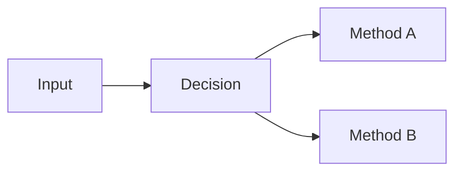
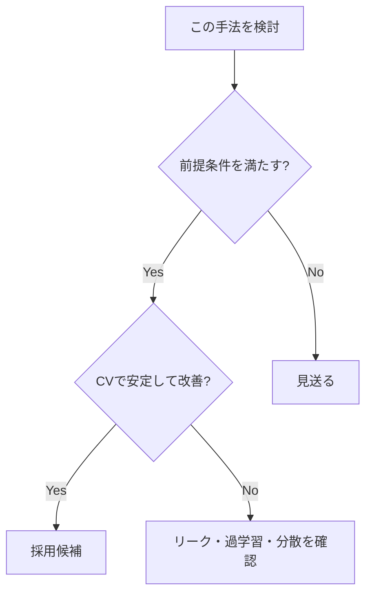
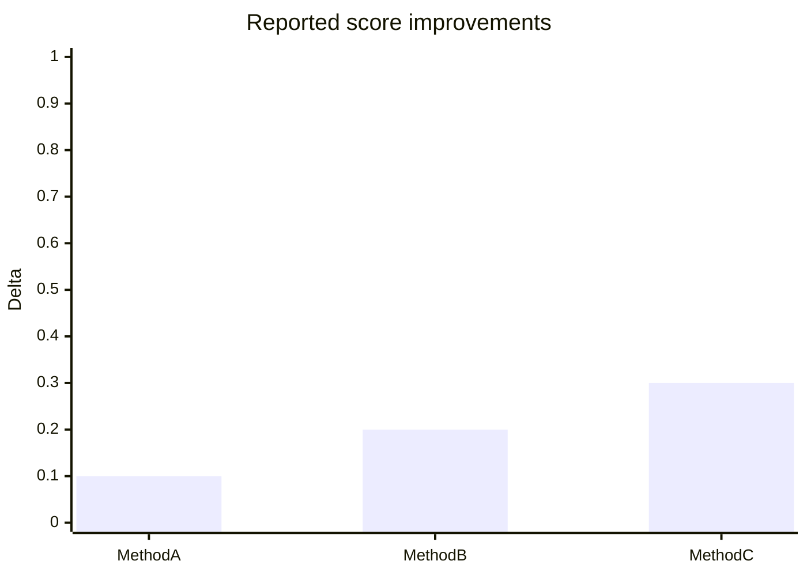

# Kaggle Wiki Page Template

```yaml
---
type: knowledge
domain: kaggle
topic: <topic-slug>
confidence: medium
created: YYYY-MM-DD
updated: YYYY-MM-DD
source_count: 0
tags:
  - kaggle
---
```

# <ページタイトル>

## TL;DR

3〜6行で結論を書く。

- 何が有効か
- どの条件で有効か
- 何に注意すべきか
- エビデンスがどの程度強いか

具体的な事実・数値・順位・採用実績には、その場で出典リンクを付ける。

例:

> 1st place solutionではGroupKFoldを採用している（[Kaggle Writeup](https://example.com/)）。

## 何が問題なのか

この手法・設計が必要になる背景を説明する。外部情報に依存する主張にはURLを直接埋め込む。

## 基本原理

数式が必要ならLaTeX/MathJaxを使う。処理関係・判断フローはMermaidを優先する。



## 可視化の選択

GitHub Pages側では以下が利用可能。詳細な記法は `wiki/visualization-guide.md` を参照する。

| 表現したいもの | 優先する手段 |
|---|---|
| 処理フロー・階層・関係 | Mermaid |
| 数式・評価指標・Loss | MathJax / LaTeX |
| 手法比較・条件比較 | Markdown table |
| 軽量な棒・線・散布図 | Chart.js |
| hover・zoom付きグラフ | Plotly |
| 宣言的な統計可視化 | Vega-Lite |
| 特殊なカスタム可視化 | D3.js |
| 地理・位置情報 | Leaflet |
| 精密な模式図 | SVG |
| 注意・補足・折りたたみ | HTML / CSS / details |
| 動画・スライド | iframe |
| 実験結果・外部図 | PNG / JPG / WebP / GIF |

原則として主要Wikiページでは、文章だけで終わらせず、内容に応じて表と図を組み合わせる。ただし複雑なライブラリを使うこと自体を目的にしない。

定量グラフは、出典から確認できる数値だけで作る。数値を推測・補間・捏造しない。

## 一般的な手法

複数コンペで広く使われる手法を整理する。

| 手法 | 目的 | 強み | 弱み | 主な適用条件 | Source |
|---|---|---|---|---|---|
|  |  |  |  |  | [出典](https://example.com/) |

## 効果が強かった手法

実際の上位解法で効果が報告されたものを整理する。

| 手法 | Competition | Rank/Medal | Metric | Effect | Evidence | Source |
|---|---|---:|---|---|---|---|
|  |  |  |  |  | A/B/C/D | [出典](https://example.com/) |

Effectに数値を入れる場合は必ず同じ行または直後に出典を付ける。

## ユニークな手法

特定コンペ固有の工夫を、以下に分離して説明する。

### コンペ固有部分

何がそのデータ・評価・制約に固有だったか。具体的な解法へのリンクを付ける。

### 一般化可能な原理

別コンペへ持ち込める抽象的な知見は何か。

## どの条件で使うべきか



## 失敗例・注意点

- Data leakage
- Validation mismatch
- Public LB overfitting
- 計算コスト
- seed依存
- distribution shift
- 推論時間制約

など、テーマに該当するものを具体的に記載する。実例を挙げる場合は出典リンクを付ける。

## 横断比較

複数コンペの結果を同じ軸で比較する。

| Competition | Data | Metric | Validation | Strong method | Unique insight | Source |
|---|---|---|---|---|---|---|
|  |  |  |  |  |  | [出典](https://example.com/) |

## 定量グラフ

出典から比較可能な数値が複数得られた場合のみ使用する。

単純な比較ならMermaid `xychart-beta` またはChart.js、hoverやzoomが有益ならPlotly、複数軸や宣言的な統計表現ならVega-Liteを優先する。



上記は構造例。実際のページでは例示値をそのまま残さず、検証済みの実測値だけを使う。グラフ直下にデータ元URLを明示する。

## 実戦チェックリスト

- [ ] 評価指標と改善対象が一致している
- [ ] Validationで改善している
- [ ] fold/seed間で安定している
- [ ] leakageを疑った
- [ ] 推論時にも同じ前処理を再現できる
- [ ] Public LBだけで判断していない
- [ ] 計算コストに見合う

## 関連ページ

- [関連テーマ](../path/page.md)

## 参考文献

本文で利用した全ソースを列挙する。

1. [著者/投稿者, “タイトル”, 媒体, 公開日](https://example.com/)
2. [Kaggle Competition / Discussion / Writeup](https://example.com/)
3. [GitHub repository / solution file](https://example.com/)

URLだけの羅列にせず、何のソースか分かるリンクテキストにする。本文中の主張から対応する参考文献へ追跡できる状態にする。
