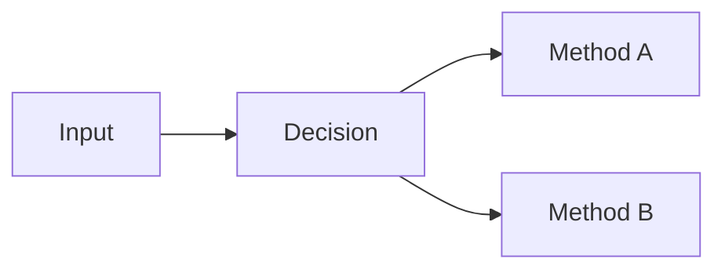
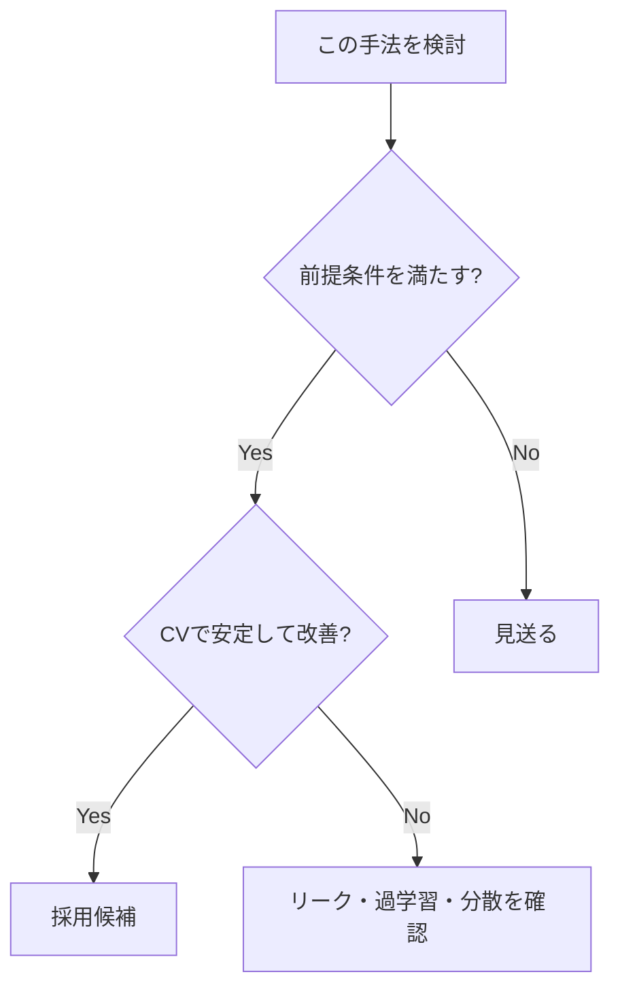
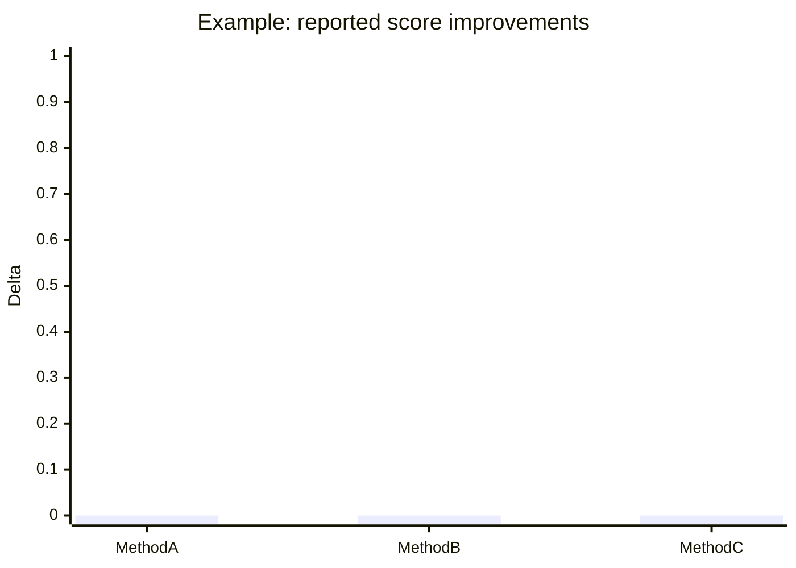

# Kaggle Wiki Page Template

```yaml
---
type: knowledge
domain: kaggle
topic: <topic-slug>
confidence: medium
created: YYYY-MM-DD
updated: YYYY-MM-DD
source_count: 0
tags:
  - kaggle
---
```

# <ページタイトル>

## TL;DR

3〜6行で結論を書く。

- 何が有効か
- どの条件で有効か
- 何に注意すべきか
- エビデンスがどの程度強いか

## 何が問題なのか

この手法・設計が必要になる背景を説明する。

## 基本原理

数式が必要ならKaTeX/LaTeXを使う。処理関係・判断フローはMermaidを優先する。



## 一般的な手法

複数コンペで広く使われる手法を整理する。

| 手法 | 目的 | 強み | 弱み | 主な適用条件 |
|---|---|---|---|---|
|  |  |  |  |  |

## 効果が強かった手法

実際の上位解法で効果が報告されたものを整理する。

| 手法 | Competition | Rank/Medal | Metric | Effect | Evidence |
|---|---|---:|---|---|---|
|  |  |  |  |  | A/B/C/D |

Effectに数値を入れる場合は必ず出典を付ける。

## ユニークな手法

特定コンペ固有の工夫を、以下に分離して説明する。

### コンペ固有部分

何がそのデータ・評価・制約に固有だったか。

### 一般化可能な原理

別コンペへ持ち込める抽象的な知見は何か。

## どの条件で使うべきか



## 失敗例・注意点

- Data leakage
- Validation mismatch
- Public LB overfitting
- 計算コスト
- seed依存
- distribution shift
- 推論時間制約

など、テーマに該当するものを具体的に記載する。

## 横断比較

複数コンペの結果を同じ軸で比較する。

| Competition | Data | Metric | Validation | Strong method | Unique insight | Source |
|---|---|---|---|---|---|---|
|  |  |  |  |  |  |  |

## 定量グラフ

出典から比較可能な数値が複数得られた場合のみ使用する。



上記は構造例。実際のページでは0.0等のダミー値を残さない。十分な実測値がなければグラフ自体を作らない。

## 実戦チェックリスト

- [ ] 評価指標と改善対象が一致している
- [ ] Validationで改善している
- [ ] fold/seed間で安定している
- [ ] leakageを疑った
- [ ] 推論時にも同じ前処理を再現できる
- [ ] Public LBだけで判断していない
- [ ] 計算コストに見合う

## 関連ページ

- [関連テーマ](../path/page.md)

## 参考文献

1. 著者/投稿者, “タイトル”, 媒体, 公開日. URL
2. Kaggle Competition / Discussion / Writeup. URL
3. GitHub repository / solution file. URL

各参考文献について、本文のどの主張を支えるか追跡可能な状態にする。
