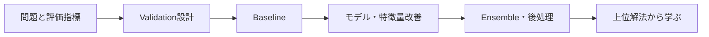

# Kagglecture

**Kaggleで「何を使うか」だけでなく、「なぜ効くのか・いつ使うのか」まで学ぶためのWikiです。**

上位解法や公開記事をもとに、Validation、評価指標、モデル改善、アンサンブル、コンペ固有の工夫まで整理します。

  <a class="primary-button" href="wiki/">学習を始める</a>
  <a class="secondary-button" href="wiki/#topics">テーマから探す</a>

## 学ぶ順番

  

    
01

    <h3>Validation</h3>
    
KFold、Stratified、Group、Time Seriesなど、正しいデータ分割を学ぶ。

  

  

    
02

    <h3>Metrics</h3>
    
AUC、F1、LogLoss、RMSEなど、評価指標と最適化の関係を理解する。

  

  

    
03

    <h3>Methods</h3>
    
特徴量、Augmentation、Pseudo Label、TTA、Ensembleなどを使い分ける。

  

  

    
04

    <h3>Winning Solutions</h3>
    
実際の上位解法から、一般化できる勝ち筋とユニークな工夫を学ぶ。

  

## このWikiで重視すること

| 観点 | 学ぶ内容 |
|---|---|
| **再現性** | Public LBだけではなく、CVで判断できるようにする |
| **使い分け** | 手法名ではなく、適用条件と失敗条件を理解する |
| **実戦性** | 実際のKaggle上位解法・Writeupを具体例にする |
| **根拠** | 数値や順位などの主張には参考文献を付ける |

  <strong>Next:</strong> <a href="wiki/">Kaggle Research Wikiを見る →</a>

