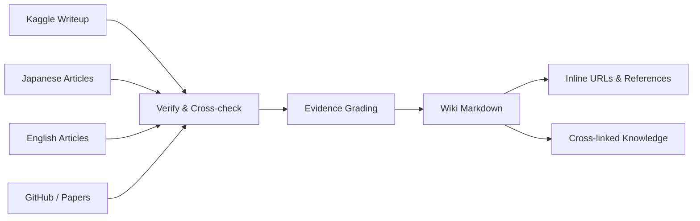
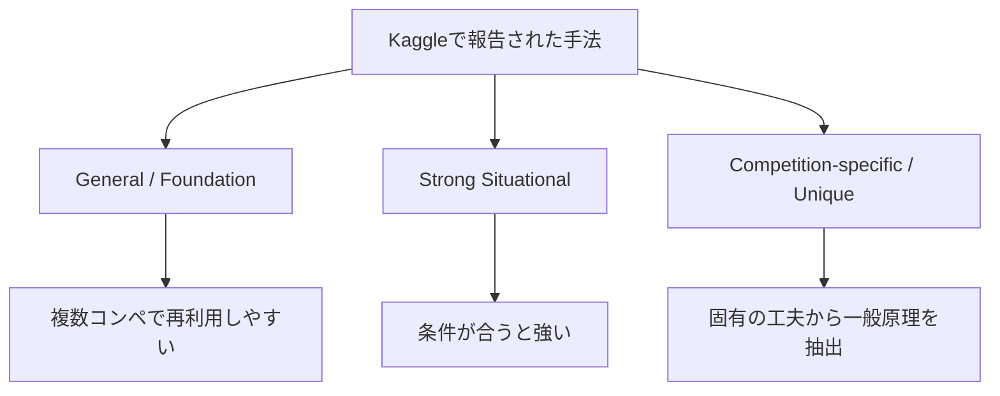

# Kagglecture

Kaggle の公開 Writeup・Discussion・Notebook・GitHub・技術記事を **日本語 / 英語の両方から横断調査**し、コンペで有効だった手法を体系化するリサーチWikiです。

一般的な勝ち筋だけでなく、特定コンペで効いたユニークな工夫についても、**効果・適用条件・失敗条件・参考文献**まで追跡します。

## Start here

- **[Kaggle Research Wiki](wiki/)** — 調査結果を統合した知識ベース
- **[GitHub Repository](https://github.com/morikazu1119/Kagglecture)** — WikiのMarkdownと調査Skill

## Knowledge Pipeline

調査ソース専用の `raw/` ディレクトリは持ちません。各Wikiページの具体的な主張に出典URLを直接紐付け、ページ末尾にも参考文献をまとめます。

## 調査する領域

| 領域 | 主なテーマ |
|---|---|
| Validation | Hold-out, KFold, Stratified, Group, Time-based, Adversarial Validation |
| Metrics | Accuracy, F1, AUC, LogLoss, RMSE, MAE, Ranking metric, custom metric |
| Modeling | GBDT, CNN, Transformer, Foundation Model, specialized architecture |
| Training | Augmentation, Sampling, Loss, Pretraining, Fine-tuning, Pseudo Label |
| Feature | Feature Engineering, Encoding, Aggregation, domain-specific features |
| Inference | TTA, Threshold, Calibration, Post-processing, Test-time adaptation |
| Ensemble | Averaging, Weighted Blend, Rank Average, Stacking, Fold/Seed Ensemble |
| Strategy | CV-LB correlation, Leakage, Leaderboard overfitting, reproducibility |

## 手法の整理

## Evidence Grade

「効いた」と書く場合は、根拠の強さも明示します。

| Grade | 根拠 |
|---|---|
| **A** | ablation・CV差・LB差などの定量根拠あり |
| **B** | 上位入賞者本人が有効性を明示し、最終解法に採用 |
| **C** | 複数の独立した上位解法で同傾向を確認 |
| **D** | 単一記事・経験談・推測。参考扱い |

## 方針

モデル名やコードを並べるだけではなく、次の問いに答えられるWikiを目指します。

- **なぜその手法が効いたのか？**
- **どんなデータで使えるのか？**
- **どんなValidationを使っていたのか？**
- **どの評価指標に対して最適化したのか？**
- **他のコンペでも再利用できる原理は何か？**
- **逆に、どんな条件では失敗するのか？**

調査ルールはリポジトリ内の `kaggle-research` Skill に定義しています。
