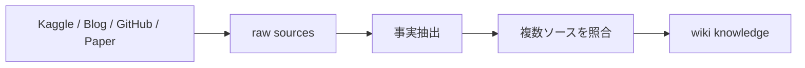

# Raw Sources

`raw/` は、Kaggle調査で確認した一次・二次ソースを保存する **事実レイヤー** です。

ここでは複数記事を統合して結論を作らず、各ソースから確認できた内容を追跡可能な形で記録します。

## 保存対象

- Kaggle Competition / Discussion / Writeup / Notebook
- 上位入賞者のGitHub
- 上位入賞者のブログ・発表資料
- Zenn / Qiita / はてなブログ等の日本語記事
- 論文・公式ドキュメント

## ファイル名

```text
raw/sources/YYYY-MM-DD_<topic>.md
```

## 記録フォーマット

| Field | 内容 |
|---|---|
| Title | 記事・Writeup名 |
| Author | 著者・投稿者 |
| URL | 原文URL |
| Language | ja / en |
| Published | 公開日。確認できる場合のみ |
| Competition | 関連コンペ |
| Rank / Medal | 確認できる場合のみ |
| Modality | Tabular / CV / NLP / Audio 等 |
| Methods | 記載されている主要手法 |
| Validation | split / CV設計 |
| Metric | 評価指標 |
| Reported Effect | CV差・LB差・ablation等 |
| Notes | 事実ベースの補足 |

## raw → wiki



解釈・一般化・横断比較は `wiki/` 側で行います。
