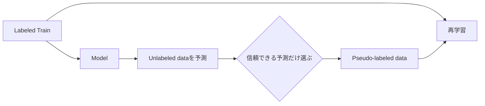

# Pseudo Labeling

**Pseudo Labelingは、モデルが未ラベルデータへ出した予測を「仮の正解」としてTrainへ追加し、もう一度学習する方法です。**

Testやexternal unlabeled dataの構造を学習へ取り込める一方、間違ったpseudo labelを増幅すると性能が落ちます。**効く条件と効かない条件の差が大きい手法**です。

<nav class="article-jump-nav" aria-label="ページ内ナビゲーション">
  <a href="#mechanism">仕組み</a>
  <a href="#selection">選び方</a>
  <a href="#kaggle-examples">Kaggle実例</a>
  <a href="#failure-examples">効かなかった例</a>
  <a href="#pitfalls">注意点</a>
  <a href="#quick-reference">Quick Reference</a>
</nav>

## 仕組み {#mechanism}

全testへ一律にhard labelを付けるより、confidence、複数モデル一致、soft labelなどでノイズを制御する方が安全です。

## 選び方 {#selection}

| 方法 | 長所 | リスク |
|---|---|---|
| 高confidenceのみ | ノイズを減らす | 易しいsampleに偏る |
| 複数モデル一致 | 信頼性を上げやすい | 同じ誤りなら防げない |
| Soft label | 不確実性を残す | Loss設計が必要 |
| 複数round | 徐々に拡張 | 誤り増幅の危険 |

## Kaggleでの実例 {#kaggle-examples}

Severstal Steel Defect Detectionの1位解法では、classifierとsegmentation networkの判定が一致し、classifier確率が0.95以上または0.05以下の画像を選択しました。1,135画像を追加し、Public LB 0.91985→0.92124、Private LB 0.90663→0.90883と報告しています（[1st Place Solution](https://www.kaggle.com/competitions/severstal-steel-defect-detection/writeups/1st-place-solution)）。これは定量根拠のある強い例です。

Jigsaw Toxic Comment Classificationの1位解法でも、TTAとPseudo Labelを含む100万件超のデータで8-fold OOF学習を行っています（[1st place solution overview](https://www.kaggle.com/competitions/jigsaw-toxic-comment-classification-challenge/writeups/toxic-crusaders-1st-place-solution-overview)）。

## 効かなかった例 {#failure-examples}

30 Days of MLの1位解法ではPseudo LabelingでCV RMSEは0.715437→0.713614と改善した一方、Leaderboardは改善しなかったと明記されています（[1st Place Solution](https://www.kaggle.com/competitions/30-days-of-ml/writeups/kaggle-swags-1st-place-solution)）。

Medical AI Contest 7th 2025の1位解法でもPseudo LabelはLB改善なしとして「効かなかったこと」に挙げられています（[1st Place Solution](https://www.kaggle.com/competitions/medical-ai-contest-7th-2025/writeups/1st-place-solution)）。

**Pseudo Labelは「上位解法が使うから効く」のではなく、pseudo labelの精度・分布差・Validation設計で成否が決まります。**

## 注意点 {#pitfalls}

### Testへの過適合

Test pseudo labelを使うCompetitionではRulesを確認します。またPublic LBでpseudo label選択を反復するとPublic sliceへ過適合します。

### Confirmation bias

初期モデルの誤りを正解として再学習すると、同じ誤りにさらに自信を持ちます。異種モデル一致や高confidence選択で緩和します。

### CVが比較不能になる

Validation行へ由来する情報をpseudo label生成に使うとリークします。OOF設計やteacher生成範囲を明確にします。

## Quick Reference {#quick-reference}

- まず強いteacherを作る。
- 全件ではなく信頼度で選別する。
- 複数モデル一致は有力な選別条件。
- Pseudo Labelなし/ありを同じValidationで比較する。
- CV改善だけでなくLBとの整合も確認する。

## 関連項目

- [Test-Time Augmentation]({{ '/wiki/advanced-methods/test-time-augmentation.html' | relative_url }})
- [Out-of-Fold Prediction]({{ '/wiki/competition-strategy/out-of-fold.html' | relative_url }})

## 参考文献

1. [Kaggle, “Severstal: Steel Defect Detection: 1st Place Solution”, 2019](https://www.kaggle.com/competitions/severstal-steel-defect-detection/writeups/1st-place-solution)
2. [Kaggle, “Jigsaw Toxic Comment Classification: 1st place solution overview”](https://www.kaggle.com/competitions/jigsaw-toxic-comment-classification-challenge/writeups/toxic-crusaders-1st-place-solution-overview)
3. [Kaggle, “30 Days of ML: 1st Place Solution”, 2021](https://www.kaggle.com/competitions/30-days-of-ml/writeups/kaggle-swags-1st-place-solution)
4. [Kaggle, “Medical AI Contest 7th 2025: 1st Place Solution”, 2026](https://www.kaggle.com/competitions/medical-ai-contest-7th-2025/writeups/1st-place-solution)
5. [Qiita, “Pseudo Labelingについて”](https://qiita.com/TS-0910/items/2706f13ece91e6179f8c)
