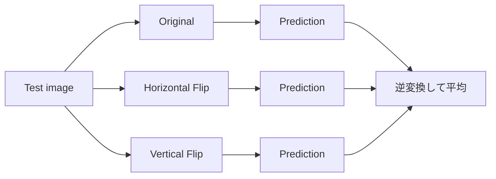

# Test-Time Augmentation

**Test-Time Augmentation（TTA）は、同じTest sampleを複数の妥当な形へ変換して推論し、その予測を平均する方法です。**

画像ならflip/crop/rotation、テキストなら意味を保つ変換などを使い、1回の推論で生じる変換依存の揺れを減らします。Training augmentationと違い、**学習済みモデルを変えず推論側で行う**のが基本です。

<nav class="article-jump-nav" aria-label="ページ内ナビゲーション">
  <a href="#mechanism">仕組み</a>
  <a href="#use-cases">使う場面</a>
  <a href="#kaggle-examples">Kaggle実例</a>
  <a href="#pitfalls">注意点</a>
  <a href="#quick-reference">Quick Reference</a>
</nav>

## 仕組み {#mechanism}

Segmentationではmaskを元座標へ逆変換してから平均します。Classificationなら確率やlogitを平均します。

## 使う場面 {#use-cases}

- ラベルがflip/rotation等に対して不変または可逆。
- 学習時augmentationと整合する変換がある。
- 推論時間を増やしてもよい。
- seed ensembleほど追加学習コストを掛けたくない。

## Kaggleでの実例 {#kaggle-examples}

Severstal Steel Defect Detectionの1位解法ではclassificationとsegmentationの両方で`None / Hflip / Vflip`のTTAを使っています（[1st Place Solution](https://www.kaggle.com/competitions/severstal-steel-defect-detection/writeups/1st-place-solution)）。

Jigsaw Toxic Comment Classificationの1位解法では、French/German/Spanishへ翻訳して英語へ戻す変換をtrain/test-time augmentationとして利用し、元commentと翻訳がsplitをまたがないようにリーク対策しています（[1st place solution overview](https://www.kaggle.com/competitions/jigsaw-toxic-comment-classification-challenge/writeups/toxic-crusaders-1st-place-solution-overview)）。

Recursion Cellular Image Classificationの1位解法もTest-time augmentationsを最終推論へ組み込んでいます（[1st Place Solution Write-up & Code](https://www.kaggle.com/competitions/recursion-cellular-image-classification/writeups/maciej-sypetkowski-1st-place-solution-write-up-cod)）。

## 注意点 {#pitfalls}

### ラベルを変えてしまう変換

数字6/9、左右性が重要な医療画像、文字方向など、変換で意味が変わる問題にflipを使うと悪化します。

### CVでもTTAを再現していない

TestだけTTAしてCVは単発推論だと、改善量を正しく比較できません。OOF/Validationにも同じTTA pipelineを適用して評価します。

### 推論コスト

8 TTAなら概ね推論回数も8倍になります。提出時間・GPU制限と比較します。

## Quick Reference {#quick-reference}

- 意味を保つ変換だけ使う。
- Validationでも同じTTAを試す。
- Segmentationは逆変換してから平均。
- TTA数と推論コストは比例しやすい。
- 単純なflipから始める。

## 関連項目

- [Weighted Average]({{ '/wiki/ensemble/weighted-average.html' | relative_url }})
- [Pseudo Labeling]({{ '/wiki/advanced-methods/pseudo-labeling.html' | relative_url }})

## 参考文献

1. [Kaggle, “Severstal: Steel Defect Detection: 1st Place Solution”, 2019](https://www.kaggle.com/competitions/severstal-steel-defect-detection/writeups/1st-place-solution)
2. [Kaggle, “Jigsaw Toxic Comment Classification: 1st place solution overview”](https://www.kaggle.com/competitions/jigsaw-toxic-comment-classification-challenge/writeups/toxic-crusaders-1st-place-solution-overview)
3. [Kaggle, “Recursion Cellular Image Classification: 1st Place Solution Write-up & Code”, 2019](https://www.kaggle.com/competitions/recursion-cellular-image-classification/writeups/maciej-sypetkowski-1st-place-solution-write-up-cod)
4. [Kaggle, “Medical AI Contest 7th 2025: 1st Place Solution”, 2026](https://www.kaggle.com/competitions/medical-ai-contest-7th-2025/writeups/1st-place-solution)
