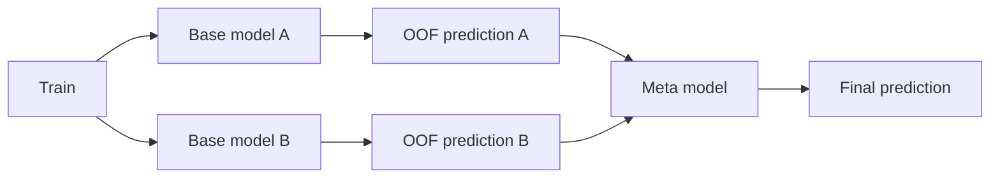

# Stacking

**Stackingは、複数のBase modelの予測を特徴量にして、別のMeta modelに最終予測を学習させるEnsembleです。**

単純平均と違い、「このモデルが強い場面では重く使う」といった組合せをデータから学べます。ただし、Meta modelへ渡すTrain予測は必ず**Out-of-Fold（OOF）予測**にしないと強いリークが起きます。

<nav class="article-jump-nav" aria-label="ページ内ナビゲーション">
  <a href="#mechanism">仕組み</a>
  <a href="#comparison">使い分け</a>
  <a href="#kaggle-examples">Kaggle実例</a>
  <a href="#pitfalls">注意点</a>
  <a href="#quick-reference">Quick Reference</a>
</nav>

## 仕組み {#mechanism}

Base modelが自分の学習に使った行を予測した値ではなく、**その行を学習していないfoldモデルの予測**をMeta modelへ渡します。scikit-learnのStackingも、final estimatorをcross-validated predictionsで学習します（[StackingRegressor](https://scikit-learn.org/stable/modules/generated/sklearn.ensemble.StackingRegressor.html)）。

## 使い分け {#comparison}

| 手法 | 組合せ方 | 過学習リスク | 計算量 |
|---|---|---:|---:|
| Weighted Average | 手動/最適化した重み | 低〜中 | 低 |
| **Stacking** | Meta modelが学習 | 中〜高 | 高 |
| Rank Average | 順位化して平均 | 低〜中 | 低 |

データ量が小さい、候補モデルが少ない、OOF差が微小ならWeighted Averageの方が安全なことがあります。

## Kaggleでの実例 {#kaggle-examples}

Tabular Playground Series Nov 2022の1位解法は10/20-fold StratifiedKFoldを使い、`scipy.minimize`によるstackingを主要改善点として挙げています（[1st Place Solution](https://www.kaggle.com/competitions/tabular-playground-series-nov-2022/writeups/1st-place-solution)）。

30 Days of MLの1位解法は、複数のLevel 1予測からLevel 2のXGBoost・Ridge・LightGBM・CatBoostを作り、さらにblendしています（[1st Place Solution](https://www.kaggle.com/competitions/30-days-of-ml/writeups/kaggle-swags-1st-place-solution)）。

松尾研 DS Dojo #4の1位解法では、Gemma-2-9BのOOF予測をLightGBMへ特徴量として渡すMeta-Stackingを使い、最終的にGemma 0.75 + LightGBM 0.25でblendしています（[1st Place Solution](https://www.kaggle.com/competitions/matsuo-institute-ds-dojo-4/writeups/1st-place-solution)）。

## 注意点 {#pitfalls}

### in-sample予測をMeta modelへ渡す

Base modelが学習した同じ行への予測は過度に良く、Meta modelが本番で再現できない関係を学びます。最重要ルールは**Train側はOOF**です。

### Stacking自体を同じOOFで過剰探索する

Meta model、特徴、重みを何百通りも同じOOFで選ぶと、OOFへ過適合します。必要ならnested CVやouter holdoutを使います。

### test予測の作り方がTrainと不整合

Base modelのtest予測は通常、各foldモデルの平均などで作ります。Meta modelが見たOOF分布とtest予測の分布が大きく変わらないようにします。

## Quick Reference {#quick-reference}

- Meta modelのTrain特徴はOOF予測。
- Base modelのfoldを揃えると管理しやすい。
- 最初は線形/Ridge/Logistic Regressionなど単純なMeta modelが安全。
- Weighted Averageを必ずbaselineにする。
- 2段目を探索するほどouter validationの価値が上がる。

## 関連項目

- [Weighted Average]({{ '/wiki/ensemble/weighted-average.html' | relative_url }})
- [Rank Averaging]({{ '/wiki/ensemble/rank-averaging.html' | relative_url }})
- [Out-of-Fold Prediction]({{ '/wiki/competition-strategy/out-of-fold.html' | relative_url }})

## 参考文献

1. [scikit-learn, “StackingRegressor”](https://scikit-learn.org/stable/modules/generated/sklearn.ensemble.StackingRegressor.html)
2. [Kaggle, “Tabular Playground Series - Nov 2022: 1st Place Solution”, 2022](https://www.kaggle.com/competitions/tabular-playground-series-nov-2022/writeups/1st-place-solution)
3. [Kaggle, “30 Days of ML: 1st Place Solution”, 2021](https://www.kaggle.com/competitions/30-days-of-ml/writeups/kaggle-swags-1st-place-solution)
4. [Kaggle, “松尾研 DS Dojo #4: 1st Place Solution”, 2026](https://www.kaggle.com/competitions/matsuo-institute-ds-dojo-4/writeups/1st-place-solution)
5. [Qiita, “Kaggleで使われるStackingを理解する”](https://qiita.com/zumitan/items/690a5ac3def649ea2a1f)
