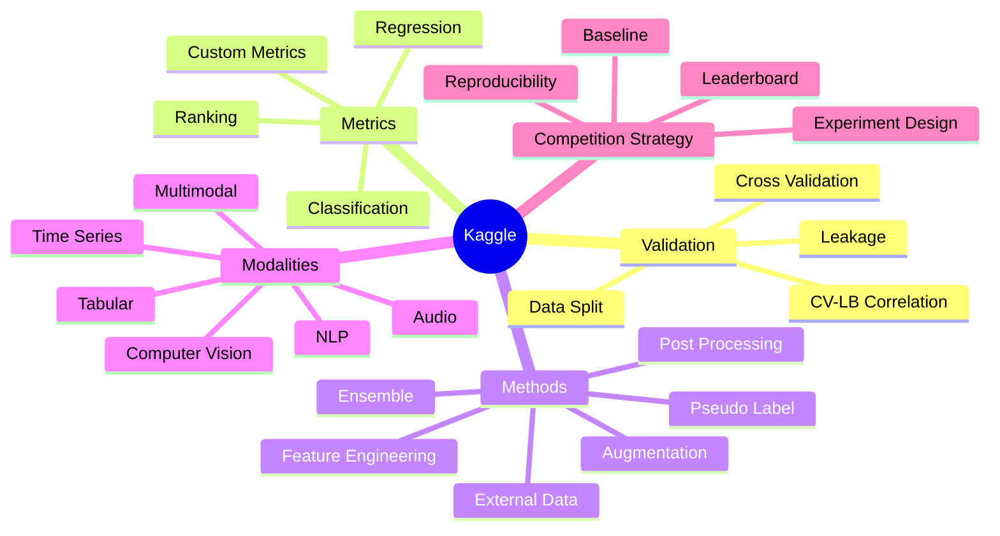
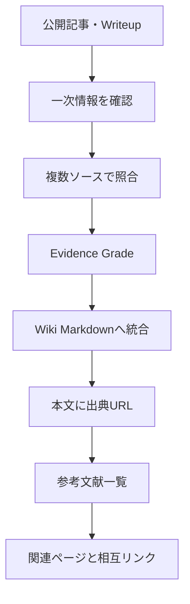

# Kaggle Research Wiki

Kaggleの公開情報を、日本語・英語の両方から横断調査して整理する知識ベースです。

## Knowledge Map

## Wiki Structure

| Directory | 内容 |
|---|---|
| `concepts/` | Kaggleで横断的に使う概念 |
| `validation/` | split・CV・リーク・validation設計 |
| `metrics/` | 評価指標と最適化上の注意点 |
| `methods/` | モデル改善・学習・推論・アンサンブル |
| `modalities/` | データ種別ごとの勝ち筋 |
| `competitions/` | 個別コンペの上位解法整理 |
| `synthesis/` | 複数コンペを横断した総合分析 |

## Research Principle

## Evidence Grade

| Grade | 解釈 |
|---|---|
| A | ablation・CV差・LB差など定量根拠あり |
| B | 上位入賞者本人が有効性を明示し最終解法に採用 |
| C | 複数の独立した上位解法で同傾向 |
| D | 単一記事・経験談・推測。参考扱い |

## References Policy

ソース保存専用ディレクトリは作りません。各Wiki Markdownを自己完結させ、具体的な事実・数値・順位・手法には対応するURLを本文中に直接埋め込みます。

各ページ末尾には `## 参考文献` を置き、使用したKaggle Discussion、Notebook、GitHub、論文、技術記事などを一覧化します。

## Research Skill

このWikiの調査・更新ルールは `.agents/skills/kaggle-research/SKILL.md` に定義しています。
