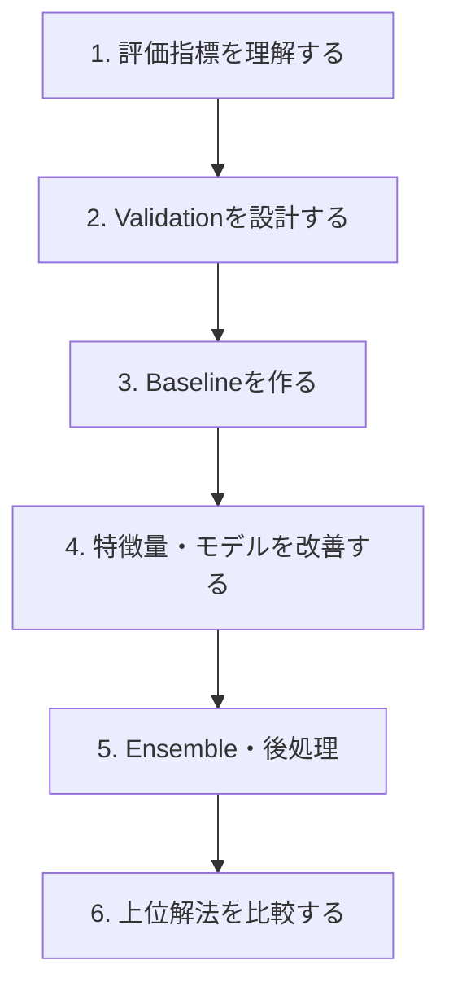

# Kaggle Wiki

Kaggleで必要になる考え方と手法を、**基礎 → 実戦 → 上位解法**の順に学べます。

  <a class="primary-button" href="#learning-path">順番に学ぶ</a>
  <a class="secondary-button" href="#topics">テーマから探す</a>

## Learning Path {#learning-path}

  
最初に重視すること

  強いモデルを探す前に、評価指標とValidationが正しいかを確認する。

## Topics {#topics}

  

    <h3>Validation & Split</h3>
    
Hold-out、KFold、Stratified、Group、Time Series、Leakage。

  

  

    <h3>Metrics</h3>
    
Accuracy、F1、AUC、LogLoss、RMSE、MAE、Ranking指標。

  

  

    <h3>Modeling</h3>
    
GBDT、CNN、Transformer、Foundation Model、モデル選択。

  

  

    <h3>Training</h3>
    
Augmentation、Loss、Sampling、Pretraining、Fine-tuning。

  

  

    <h3>Strong Methods</h3>
    
Pseudo Label、External Data、TTA、Calibration、Post-processing。

  

  

    <h3>Ensemble</h3>
    
Averaging、Weighted Blend、Rank Average、Stacking、Fold/Seed Ensemble。

  

  

    <h3>Competition Strategy</h3>
    
CV-LB correlation、Leaderboard overfitting、Shake-up、再現性。

  

  

    <h3>Winning Solutions</h3>
    
上位解法から、一般的な勝ち筋とコンペ固有の工夫を比較する。

  

## データ種別から学ぶ

| データ | 特に重要なテーマ |
|---|---|
| **Tabular** | GBDT、Feature Engineering、Target Encoding、CV |
| **Computer Vision** | Augmentation、Pretraining、TTA、Ensemble |
| **NLP** | Transformer、Length設計、Pooling、Pseudo Label |
| **Time Series** | 時系列Split、Lag、Rolling、Leakage |
| **Audio** | Spectrogram、Augmentation、CV設計 |
| **Multimodal** | 複数モダリティの融合、Pretraining、Ensemble |

## 記事の読み方

各記事では、必要に応じて次の順で整理します。

1. **結論** — 何が重要か
2. **直感** — なぜそうなるか
3. **使い分け** — どんな条件で選ぶか
4. **Kaggle実例** — 実際にどのコンペで使われたか
5. **注意点** — Leakageや過学習など
6. **参考文献** — Writeup・Notebook・GitHub・論文

  <strong>基本方針:</strong> 読むための説明より、コンペで判断できる知識を優先します。

