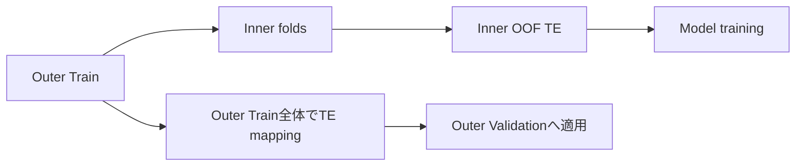

# Target Encoding

**Target Encoding（TE）は、カテゴリごとのtarget平均などを数値特徴へ変換する方法です。**

たとえば`city=Tokyo`の離職率が20%なら`city_te=0.20`のように表現できます。高cardinalityカテゴリでも強力ですが、**その行自身のtargetを統計へ混ぜると答えを特徴量へ埋め込むことになる**ため、Leakage対策が最重要です。

<nav class="article-jump-nav" aria-label="ページ内ナビゲーション">
  <a href="#mechanism">仕組み</a>
  <a href="#leak-free">Leak-free設計</a>
  <a href="#kaggle-examples">Kaggle実例</a>
  <a href="#pitfalls">注意点</a>
  <a href="#quick-reference">Quick Reference</a>
</nav>

## 仕組み {#mechanism}

単純な平均TEはカテゴリ`c`について次です。

$$
TE(c)=\frac{\sum_{i:x_i=c} y_i}{N_c}
$$

件数が少ないカテゴリでは値が極端になるため、global meanへ寄せるsmoothingをよく使います。

## Leak-free設計 {#leak-free}

Validation行のTEは、**Train foldのtargetだけ**で計算します。

さらにTrain fold自身へTE特徴を作る場合も、その行のtargetを直接含まないようinner-fold OOFやordered encodingを使います。

## Kaggleでの実例 {#kaggle-examples}

Playground Series S6E3の1位解法では、Target Encodingを**各outer CV foldの内側でさらに5-foldに分けるnested / leak-free設計**で作っています。Raw categoricalだけでなく組合せやbinned numericにも適用し、TEだけで約90モデルを構築しています（[1st Place Solution](https://www.kaggle.com/competitions/playground-series-s6e3/writeups/1st-place-gpt5-4-gemini3-1-claudeopus4-6-kgm)）。

Playground Series S6E7の4位解法でも、13 raw featuresに39個のexact-value Target Encoding特徴を追加し、全target-derived featureをtraining fold内でfitしています。OOF balanced accuracy 0.95063の最終候補をPublic #414でも維持し、Private #4となりました（[4th Place Solution](https://www.kaggle.com/c/playground-series-s6e7/writeups/4th-place-from-414-to-4-trusting-oof-when-the)）。

## 注意点 {#pitfalls}

### 全Trainでmappingを作ってからCV

Validation targetがTEへ混ざるため、CVが大幅に過大評価されます。CVより前にTEを作らないことが基本です。

### rare category

件数1のカテゴリでtarget=1ならTE=1になり、ほぼラベルコピーです。minimum countやsmoothing、noise、OOF化を使います。

### Test-only category

Trainにないカテゴリはglobal meanなど事前に決めたfallbackへ置換します。

### 時系列

未来targetを過去行のTEへ含めないよう、時間方向も守る必要があります。

## Quick Reference {#quick-reference}

- target由来特徴はfold内で作る。
- Train側TEもinner OOF/ordered方式で自己参照を避ける。
- rare categoryをsmoothingする。
- unseen categoryのfallbackを決める。
- TE追加後のCV改善がLeakageでないか最優先で確認する。

## 関連項目

- [KFold]({{ '/wiki/validation/kfold.html' | relative_url }})
- [GroupKFold]({{ '/wiki/validation/group-kfold.html' | relative_url }})
- [Out-of-Fold Prediction]({{ '/wiki/competition-strategy/out-of-fold.html' | relative_url }})

## 参考文献

1. [Kaggle, “Playground Series S6E3: 1st Place - KGMON Playbook”, 2026](https://www.kaggle.com/competitions/playground-series-s6e3/writeups/1st-place-gpt5-4-gemini3-1-claudeopus4-6-kgm)
2. [Kaggle, “Predicting Student Health Risk: 4th Place - Trusting OOF”, 2026](https://www.kaggle.com/c/playground-series-s6e7/writeups/4th-place-from-414-to-4-trusting-oof-when-the)
3. [CatBoost, “Categorical features”](https://catboost.ai/en/docs/features/categorical-features)
4. [scikit-learn, “TargetEncoder”](https://scikit-learn.org/stable/modules/generated/sklearn.preprocessing.TargetEncoder.html)
