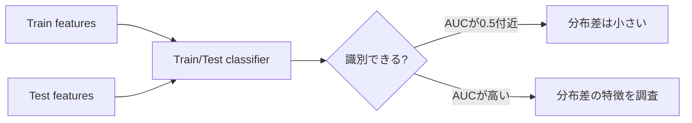

# Adversarial Validation

**Adversarial Validationは、元のtargetを予測する代わりに「この行はTrainかTestか」を予測し、Train/Testの分布差を調べる方法です。**

TrainとTestを高精度で見分けられるなら、手元のCVがLeaderboard条件を再現できていない可能性があります。主用途はスコアを直接上げることではなく、**distribution shiftの診断**です。

<nav class="article-jump-nav" aria-label="ページ内ナビゲーション">
  <a href="#use-cases">使う場面</a>
  <a href="#mechanism">仕組み</a>
  <a href="#interpretation">読み方</a>
  <a href="#kaggle-examples">Kaggle実例</a>
  <a href="#pitfalls">注意点</a>
  <a href="#quick-reference">Quick Reference</a>
</nav>

## 使う場面 {#use-cases}

- CVは改善するのにPublic LBが悪化する。
- train/testの時期、地域、装置、取得元が異なる。
- 欠損率やカテゴリ出現率がtrain/testで違う。
- 特定特徴量がsplit識別器にだけ強く効く。

## 仕組み {#mechanism}

1. Trainに`is_test=0`、Testに`is_test=1`を付ける。
2. 元targetは使わず、`is_test`を予測する分類器を学習する。
3. OOF ROC-AUCなどで「見分けやすさ」を測る。
4. feature importanceやSHAPで分布差の原因を見る。

## 読み方 {#interpretation}

AUC=0.5付近なら識別器はほぼランダムです。AUCが高いほどTrain/Testを区別しやすいですが、**「0.6なら危険、0.8なら必ずCVを変更」のような普遍的閾値はありません**。識別に使われた特徴と、本番targetへの関係を確認します。

## Kaggleでの実例 {#kaggle-examples}

MWS Cup 2022の1位解法では、Train/Test識別の10-fold OOF AUCが0.848で、train=2020年、test=2022年という分布差に対応してAdversarial Validationを試しています。通常OOFよりPublic LBに近い場合もあった一方、相関は確実ではなかったと報告しています（[1st place solution](https://www.kaggle.com/competitions/mws-cup-2022-3/discussion/362177)）。

IEEE-CIS Fraud Detectionの41位解法では、特徴ごとにTrainとprivate testを識別し、Adversarial Validation AUCが60%以下の特徴だけを残す分岐も作っています（[41st place solution](https://www.kaggle.com/competitions/ieee-fraud-detection/writeups/lets-try-not-to-drop-1000-places-41st-place-soluti)）。

## 注意点 {#pitfalls}

### AUCだけで特徴を消す

Train/Testを区別できる特徴が、元target予測にも本番で有効なことがあります。split識別力だけを理由に削除すると信号まで失う可能性があります。

### testを使った選択のしすぎ

Adversarial Validationを何度も見て特徴量や重みを最適化すると、test分布への間接的な過適合になります。診断と仮説検証に使い、選択自由度を増やしすぎない方が安全です。

### hidden private分布は見えない

公開test featuresが最終評価対象と完全に同じ分布とは限りません。特に時間進行型Competitionでは注意が必要です。

## Quick Reference {#quick-reference}

- targetではなくTrain/Testラベルを予測する。
- AUCが高いほど分布差を疑う。
- 重要なのはAUC値より「何が識別しているか」。
- 特徴削除は元targetのCVとセットで判断する。
- CV-LB mismatchの診断に使う。

## 関連項目

- [TimeSeriesSplit]({{ '/wiki/validation/time-series-split.html' | relative_url }})
- [KFold]({{ '/wiki/validation/kfold.html' | relative_url }})
- [ROC-AUC]({{ '/wiki/metrics/roc-auc.html' | relative_url }})

## 参考文献

1. [Kaggle, “MWS Cup 2022: 1st place solution”, 2022](https://www.kaggle.com/competitions/mws-cup-2022-3/discussion/362177)
2. [Kaggle, “IEEE-CIS Fraud Detection: 41st place solution”](https://www.kaggle.com/competitions/ieee-fraud-detection/writeups/lets-try-not-to-drop-1000-places-41st-place-soluti)
3. [Kaggle, “Predicting Student Health Risk: Adversarial Validation Insight”, 2026](https://www.kaggle.com/competitions/playground-series-s6e7/discussion/718921)
4. [Qiita, “一流の「ものさし」職人になろう Cross Validationを深堀り”, 2019](https://qiita.com/Hatomugi/items/620c1bc757266b00e87f)
