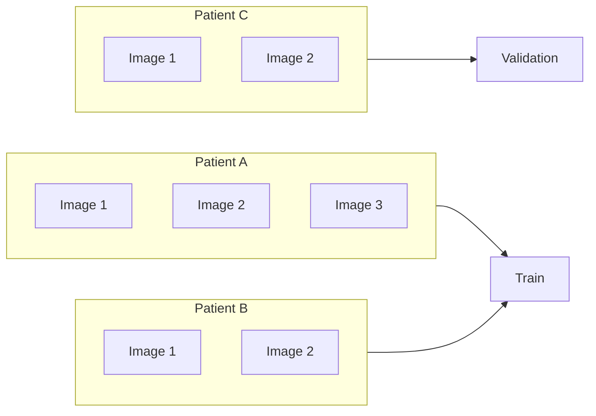

# GroupKFold

**GroupKFoldは、同じ患者・ユーザー・セッション・撮影者などの「同一グループ」がTrainとValidationの両方に入らないように分割するCross Validationです。**

同じ主体から複数サンプルが生成されるデータでは、通常のKFoldだと非常によく似たサンプルがTrainとValidationに分かれ、CVを過大評価することがあります。GroupKFoldはこの問題を避けるために使います（[scikit-learn: GroupKFold](https://scikit-learn.org/stable/modules/generated/sklearn.model_selection.GroupKFold.html)）。

## 使う場面

判断基準は、**テスト時に未知になる単位をgroupにする**ことです。

| データ | groupの例 | GroupKFold |
|---|---|---|
| 医療画像 | patient_id | 適する |
| 同一ユーザーの行動ログ | user_id | 適する |
| 検索・推薦 | session_id / search_id | 適する |
| 音声・画像投稿 | author / speaker | 適する |
| 複数年の大会データ | season | 条件次第で適する |
| 各行が独立した表形式データ | なし | 通常は不要 |
| 時系列で未来を予測 | timestamp | Time-based splitを優先 |

  
最重要

  groupは「データ上同じIDだから」ではなく、TrainからValidationへ情報が伝わってはいけない単位で決める。

## 仕組み

GroupKFoldでは、1つのgroupは必ず1つのValidation foldにだけ所属します。scikit-learnの実装でも、各groupは全foldを通じてちょうど1回test側に現れる仕様です（[scikit-learn: GroupKFold](https://scikit-learn.org/stable/modules/generated/sklearn.model_selection.GroupKFold.html)）。

患者Cの画像だけをValidationに置き、同じ患者Cの別画像がTrainに混ざらないようにします。

## 使い分け

| 手法 | グループ分離 | クラス比維持 | 主な用途 |
|---|---:|---:|---|
| **KFold** | × | × | 各サンプルが独立 |
| **StratifiedKFold** | × | ○ | クラス不均衡の分類 |
| **GroupKFold** | ○ | × | 同一主体の重複を防ぐ |
| **StratifiedGroupKFold** | ○ | ○に近づける | group分離とクラス比の両方が重要 |
| **Time-based split** | 設計次第 | × | 未来予測・時系列 |

`StratifiedGroupKFold`は、groupを分離しながら各foldのクラス比も可能な限り維持する手法です。GroupKFoldだけではラベル比が大きく崩れる分類問題で候補になります（[scikit-learn: Cross-validation / StratifiedGroupKFold](https://scikit-learn.org/stable/modules/cross_validation.html#stratifiedgroupkfold)）。

## Kaggleでの実例

GroupKFoldで重要なのは、コンペごとに**何をgroupと見なしたか**です。

| Competition | Rank | group | 理由 | Source |
|---|---:|---|---|---|
| FlightRank 2025 | 2nd | search session | 同じ検索セッションの候補をfold間で分離し、behavioral featureのleakageを防ぐ | [2nd Place Solution](https://www.kaggle.com/competitions/aeroclub-recsys-2025/writeups/flightrank-2025-2nd-place-solution) |
| March Machine Learning Mania 2026 | 4th | season | season単位でGroupKFoldを行い、シーズンをまたいだ評価にする | [4th Place Solution](https://www.kaggle.com/c/march-machine-learning-mania-2026/writeups/4th-place-solution-for-the-march-machine-learning) |
| BirdCLEF 2022 | 23rd | author | 同じ録音投稿者がTrainとValidationに現れないようにする | [23th Place Solution](https://www.kaggle.com/competitions/birdclef-2022/writeups/bilzard-23th-place-solution) |
| 26-shinnen-3Dpathology | 1st team solution | crop_id / patient単位 | 同一患者由来の画像をfold間で分離 | [1st place solution](https://www.kaggle.com/competitions/26-shinnen-3-dp/discussion/671614) |

### FlightRank 2025

2位解法では、検索セッションをgroupとしたGroupKFoldを採用しています。同一検索内のフライト候補は相互に強く関連するため、同じsessionがTrainとValidationに分かれると、behavioral feature作成時に情報が混ざる可能性があります。解法では10-fold GroupKFoldを用い、同じ検索セッションのフライトをまとめて分離しています（[FlightRank 2025: 2nd Place Solution](https://www.kaggle.com/competitions/aeroclub-recsys-2025/writeups/flightrank-2025-2nd-place-solution)）。

### BirdCLEF 2022

23位解法では`author`をgroupとしてStratifiedGroupKFoldを使用しています。著者ごとの録音環境や投稿傾向がTrainとValidationの両方に入ることを避ける狙いです。Writeupでも同じAuthorをtrainingとevaluationに出さないことを明示しています（[BirdCLEF 2022: 23th Place Solution](https://www.kaggle.com/competitions/birdclef-2022/writeups/bilzard-23th-place-solution)）。

### 3D Pathology

日本語の1位チーム解法では、`crop_id`やpatient単位を使った5-fold GroupKFoldが採用されています。患者由来の複数画像を独立サンプルとしてランダム分割しない設計です（[26-shinnen-3Dpathology: 1st place solution](https://www.kaggle.com/competitions/26-shinnen-3-dp/discussion/671614)）。

## 注意点

### groupの選び方を間違えると意味がない

たとえば患者ごとに複数画像があるのに`image_id`をgroupにしても、ほぼ各サンプルが独立groupになるため患者リークは防げません。**予測対象の独立単位より細かいIDをgroupにしない**ことが重要です。

### GroupKFoldは時系列制約を保証しない

seasonやuserで分けても、未来データがTrainに入り過去データをValidationにする可能性があります。時間順序そのものが評価条件なら、GroupKFoldではなくTime-based splitやPurged系のCVを検討します。Ubiquant Market Predictionの1位解法でも、feature engineeringやparameter tuningではPurgedGroupTimeSeries / TimeSeriesSplitを使い、training用CVでは別のsplitを検討していました（[Ubiquant Market Prediction: 1st Place Solution](https://www.kaggle.com/competitions/ubiquant-market-prediction/writeups/k-i-y-1st-place-solution-our-betting-strategy)）。

### ラベル比が崩れることがある

groupごとにラベル分布が偏っていると、あるfoldだけpositiveが多いといった状況が起こります。その場合はStratifiedGroupKFoldを候補にします。ただしgroup制約が強いほど完全なstratificationは難しくなります（[scikit-learn: StratifiedGroupKFold](https://scikit-learn.org/stable/modules/cross_validation.html#stratifiedgroupkfold)）。

### fold数よりgroup数が少ないと使えない

GroupKFoldでは、distinct group数が`n_splits`以上必要です（[scikit-learn: GroupKFold](https://scikit-learn.org/stable/modules/generated/sklearn.model_selection.GroupKFold.html)）。

## Quick Reference

| 状況 | 選択 |
|---|---|
| 同一患者から複数サンプル | GroupKFold |
| 同一ユーザーから複数行 | GroupKFold |
| groupあり + クラス不均衡 | StratifiedGroupKFold |
| 行が独立 + クラス不均衡 | StratifiedKFold |
| 時系列で未来予測 | Time-based split |
| groupの意味が分からない | データ生成過程を先に確認 |

**迷ったら「本番テストで初めて現れる単位は何か？」を考え、その単位がfoldをまたがないようにします。**

## 関連項目

- KFold
- StratifiedKFold
- StratifiedGroupKFold
- Time-based Split
- Data Leakage
- CV-LB Correlation

## 参考文献

1. [scikit-learn, “GroupKFold”](https://scikit-learn.org/stable/modules/generated/sklearn.model_selection.GroupKFold.html)
2. [scikit-learn, “Cross-validation: StratifiedGroupKFold”](https://scikit-learn.org/stable/modules/cross_validation.html#stratifiedgroupkfold)
3. [Kaggle, “FlightRank 2025: 2nd Place Solution”](https://www.kaggle.com/competitions/aeroclub-recsys-2025/writeups/flightrank-2025-2nd-place-solution)
4. [Kaggle, “4th Place Solution for the March Machine Learning Mania 2026 Competition”](https://www.kaggle.com/c/march-machine-learning-mania-2026/writeups/4th-place-solution-for-the-march-machine-learning)
5. [Kaggle, “BirdCLEF 2022: 23th Place Solution”](https://www.kaggle.com/competitions/birdclef-2022/writeups/bilzard-23th-place-solution)
6. [Kaggle, “26-shinnen-3Dpathology: 1st place solution”, 2026](https://www.kaggle.com/competitions/26-shinnen-3-dp/discussion/671614)
7. [Kaggle, “Ubiquant Market Prediction: 1st Place Solution - Our Betting Strategy”](https://www.kaggle.com/competitions/ubiquant-market-prediction/writeups/k-i-y-1st-place-solution-our-betting-strategy)
