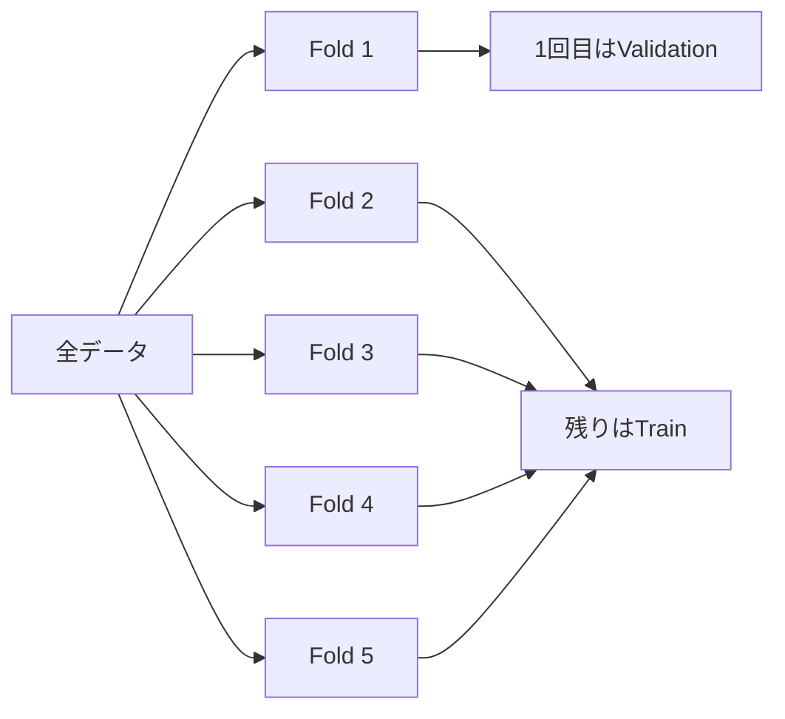

# KFold

**KFoldは、学習データをK個のfoldに分け、1個をValidation、残りをTrainとしてK回評価するCross Validationです。**

1回のHold-outより多くのデータを評価に使えるため、モデル変更の良し悪しを安定して比較しやすくなります。ただし、行同士が独立でないデータや時系列では、そのまま使うとリークすることがあります（[scikit-learn: Cross-validation](https://scikit-learn.org/stable/modules/cross_validation.html)）。

<nav class="article-jump-nav" aria-label="ページ内ナビゲーション">
  <a href="#use-cases">使う場面</a>
  <a href="#mechanism">仕組み</a>
  <a href="#comparison">使い分け</a>
  <a href="#kaggle-examples">Kaggle実例</a>
  <a href="#pitfalls">注意点</a>
  <a href="#quick-reference">Quick Reference</a>
</nav>

## 使う場面 {#use-cases}

| 状況 | KFold |
|---|---|
| 各行がほぼ独立 | 向いている |
| 回帰で単純な表形式データ | 候補 |
| クラス不均衡が強い分類 | StratifiedKFoldを優先 |
| 同じ患者・ユーザーから複数行 | GroupKFoldを優先 |
| 未来を予測する時系列 | Time-based splitを優先 |

## 仕組み {#mechanism}

5-foldなら、各サンプルは**4回Trainに使われ、1回Validationに使われます**。

最終的には各foldのスコア平均や、全行のOut-of-Fold予測から計算したスコアでモデルを比較します。

## 使い分け {#comparison}

| 手法 | 守るもの | 主な用途 |
|---|---|---|
| Hold-out | 1回だけ分離 | 高速な初期実験 |
| **KFold** | 各行を均等に評価 | 独立サンプル |
| StratifiedKFold | クラス比 | 不均衡分類 |
| [GroupKFold]({{ '/wiki/validation/group-kfold.html' | relative_url }}) | group境界 | 患者・user等 |
| TimeSeriesSplit | 時間順序 | 時系列 |

## Kaggleでの実例 {#kaggle-examples}

UOS AIBA 2202 Competition1の1位解法では、LightGBMのベースラインを5-fold KFoldで評価しています（[1st place solution](https://www.kaggle.com/competitions/uos-aiba-2202-competition1/writeups/kentak0928-appreciate-the-host-and-sharing-my-appr)）。

一方、上位解法ではデータ生成構造に応じてKFoldをそのまま使わず、Stratified、Group、時間分割へ置き換える例も多くあります。**KFoldはデフォルトではなく、独立性を確認した上で選ぶ基本形**と考えるのが安全です。

## 注意点 {#pitfalls}

### 同一主体がfoldをまたぐ

同じ患者の複数画像や同じユーザーの複数ログが別foldに入ると、Validationが本番より簡単になります。この場合は[GroupKFold]({{ '/wiki/validation/group-kfold.html' | relative_url }})を使います。

### 時系列をshuffleする

未来の情報で過去を予測する評価になり、本番条件と逆転することがあります。未来予測では時間軸を壊さない分割が必要です。

### foldごとに前処理をfitしていない

標準化、特徴選択、Target Encoding、欠損補完などを全データでfitしてからKFoldすると、Validationの情報がTrainへ混ざります。前処理もfold内でfitします。

## Quick Reference {#quick-reference}

- 行が独立しているかを最初に確認する。
- 5-fold前後は計算量と安定性のバランスを取りやすい。
- 分類でクラス偏りがあるならStratifiedを検討する。
- group・時間・重複があるなら通常KFoldを使わない。
- 前処理は各foldのTrainだけでfitする。

## 関連項目

- [GroupKFold]({{ '/wiki/validation/group-kfold.html' | relative_url }})
- [StratifiedKFold]({{ '/wiki/validation/stratified-kfold.html' | relative_url }})
- [TimeSeriesSplit]({{ '/wiki/validation/time-series-split.html' | relative_url }})

## 参考文献

1. [scikit-learn, “Cross-validation: evaluating estimator performance”](https://scikit-learn.org/stable/modules/cross_validation.html)
2. [Kaggle, “UOS AIBA 2202 Competition1: 1st place solution”, 2023](https://www.kaggle.com/competitions/uos-aiba-2202-competition1/writeups/kentak0928-appreciate-the-host-and-sharing-my-appr)
3. [Qiita, “一流の「ものさし」職人になろう Cross Validationを深堀り”, 2019](https://qiita.com/Hatomugi/items/620c1bc757266b00e87f)
