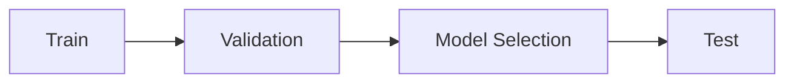
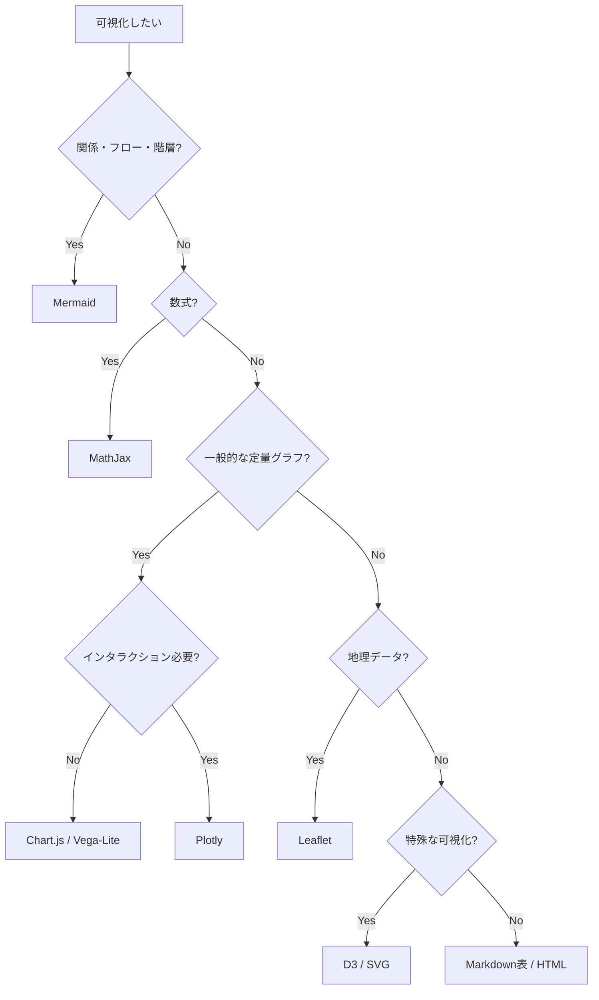

# Visualization Guide

Kagglecture の GitHub Pages では、Markdownに加えて以下を利用できます。

| 表現 | 用途 |
|---|---|
| Mermaid | フロー、モデル構造、判断木、mindmap、sequence、xychart |
| MathJax / LaTeX | 評価指標、Loss、統計式、数式 |
| Chart.js | 軽量な棒・線・散布図 |
| Plotly | ズーム・hover付きのインタラクティブグラフ |
| Vega / Vega-Lite | 宣言的な統計可視化 |
| D3.js | 特殊なカスタム可視化 |
| Leaflet | 地理・位置情報データの地図 |
| SVG | モデルやデータ構造の精密な模式図 |
| HTML / CSS | callout、カード、折りたたみ、レイアウト |
| iframe | YouTube、Slides等の埋め込み |
| PNG / JPG / WebP / GIF | 外部図、結果図、アニメーション |

Chart.js、Plotly、Vega、D3、Leafletは必要時のみCDNから読み込むため、使わないページでは大きなJavaScriptを読み込みません。

## Mermaid

````markdown

````

## LaTeX

インライン数式:

```text
$F_1 = 2 \frac{PR}{P+R}$
```

ブロック数式:

```text
$$
RMSE = \sqrt{\frac{1}{N}\sum_{i=1}^{N}(y_i-\hat{y}_i)^2}
$$
```

## Chart.js

```html
<div class="chart-container">
  <canvas id="score-chart" data-viz="chartjs"></canvas>
</div>

<script>
KagglectureViz.chartjs().then(() => {
  new Chart(document.getElementById('score-chart'), {
    type: 'bar',
    data: {
      labels: ['Baseline', 'Feature', 'Ensemble'],
      datasets: [{
        label: 'CV Score',
        data: [0.81, 0.84, 0.86]
      }]
    }
  });
});
</script>
```

## Plotly

```html
<div id="plotly-score" class="plotly-container" data-viz="plotly"></div>

<script>
KagglectureViz.plotly().then(() => {
  Plotly.newPlot('plotly-score', [{
    x: ['Baseline', 'Pseudo Label', 'Ensemble'],
    y: [0.81, 0.84, 0.86],
    type: 'bar'
  }], {
    title: 'Reported CV score'
  }, {
    responsive: true
  });
});
</script>
```

## Vega-Lite

```html
<div id="vega-score" class="vega-container" data-viz="vega-lite"></div>

<script>
KagglectureViz.vega().then(() => {
  vegaEmbed('#vega-score', {
    $schema: 'https://vega.github.io/schema/vega-lite/v5.json',
    data: {
      values: [
        {method: 'Baseline', score: 0.81},
        {method: 'Feature', score: 0.84},
        {method: 'Ensemble', score: 0.86}
      ]
    },
    mark: 'bar',
    encoding: {
      x: {field: 'method', type: 'nominal'},
      y: {field: 'score', type: 'quantitative'}
    }
  });
});
</script>
```

## D3.js

```html
<div id="d3-example" class="d3-container" data-viz="d3"></div>

<script>
KagglectureViz.d3().then(() => {
  const svg = d3.select('#d3-example')
    .append('svg')
    .attr('viewBox', '0 0 600 180');

  svg.append('circle')
    .attr('cx', 120)
    .attr('cy', 90)
    .attr('r', 45);
});
</script>
```

D3は自由度が高いため、Mermaid・Chart.js・Vega-Liteで表現できない場合に優先します。

## Leaflet

```html
<div id="map" class="map-container" data-viz="leaflet"></div>

<script>
KagglectureViz.leaflet().then(() => {
  const map = L.map('map').setView([35.6812, 139.7671], 11);

  L.tileLayer('https://tile.openstreetmap.org/{z}/{x}/{y}.png', {
    maxZoom: 19,
    attribution: '&copy; OpenStreetMap contributors'
  }).addTo(map);

  L.marker([35.6812, 139.7671]).addTo(map);
});
</script>
```

## SVG

SVGは追加ライブラリ不要です。

```html
<div class="svg-container">
<svg viewBox="0 0 600 160" role="img" aria-label="OOF pipeline">
  <rect x="20" y="50" width="140" height="60" rx="8" fill="#eff6ff" stroke="#2563eb"/>
  <text x="90" y="85" text-anchor="middle">Train</text>
  <line x1="160" y1="80" x2="250" y2="80" stroke="currentColor"/>
  <rect x="250" y="50" width="140" height="60" rx="8" fill="#ecfdf5" stroke="#059669"/>
  <text x="320" y="85" text-anchor="middle">OOF</text>
</svg>
</div>
```

## Callout

```html
<div class="callout warning">
  <div class="callout-title">Validation Leakage</div>
  split前に全データで統計量を計算すると、validation情報がtrainへ混入する可能性がある。
</div>
```

利用可能なclass:

- `callout`
- `callout tip`
- `callout warning`
- `callout danger`

## 折りたたみ

```html
<details>
<summary>なぜGroupKFoldが必要？</summary>

同一患者・ユーザー・個体が複数行に存在する場合、通常のランダム分割では同一主体がtrainとvalidationの両方に入る可能性がある。

</details>
```

## iframe

```html
<div class="embed-container">
  <iframe
    src="https://www.youtube.com/embed/VIDEO_ID"
    title="Video"
    loading="lazy"
    allowfullscreen>
  </iframe>
</div>
```

## 画像

```markdown

```

外部画像を直接参照する場合は、出典と利用条件を確認する。

## 選択基準



原則として、複雑なライブラリを使うこと自体を目的にしない。Kaggleの手法・結果・適用条件を最短で理解できる表現を選ぶ。
